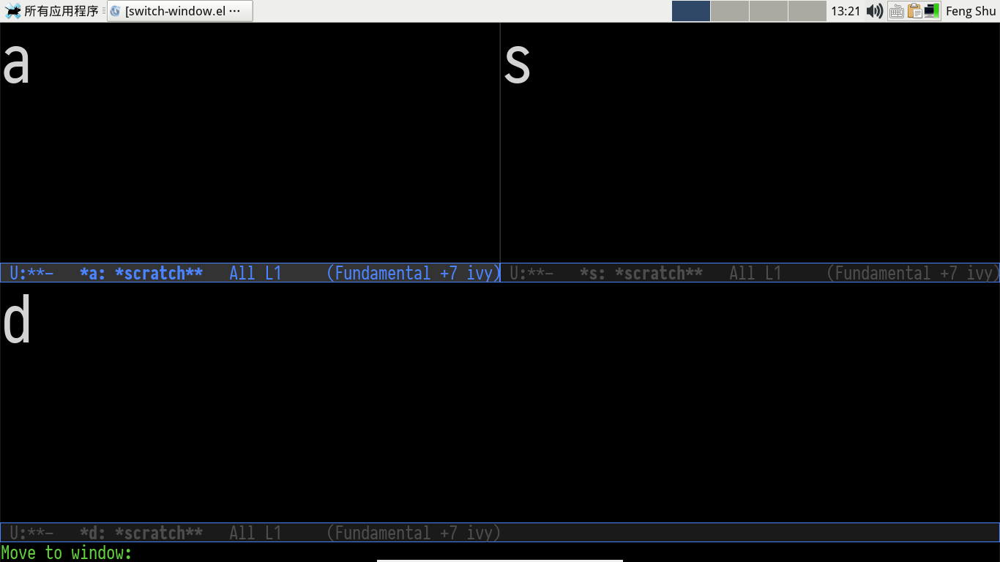
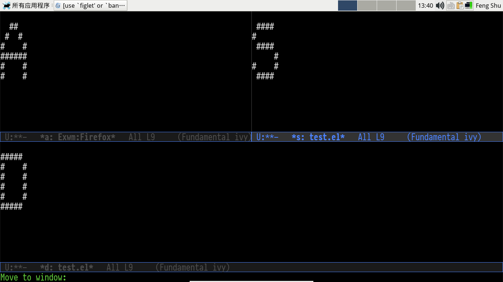
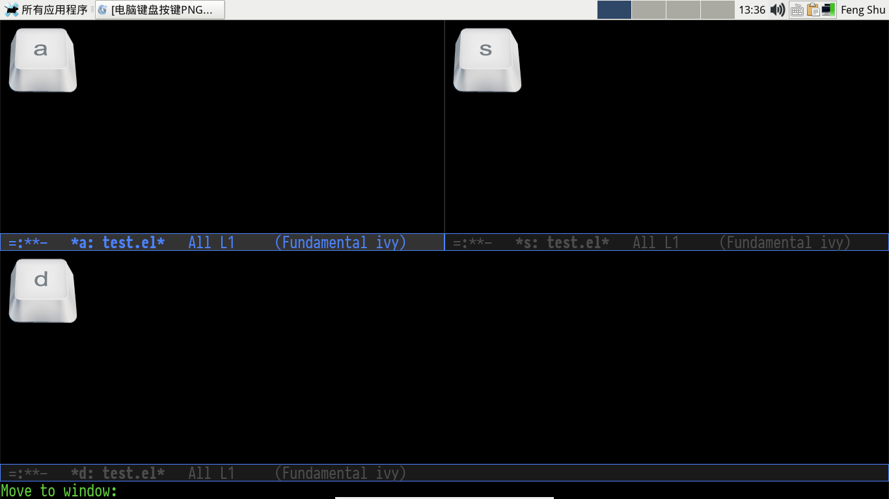

# &#30446;&#24405;

1.  [What is switch-window](#org9b80f3a)
    1.  [Installation](#org1901772)
    2.  [Configure and Usage](#org01196ff)
    3.  [Tips](#org2d38818)
        1.  [I want to select a window with "a-z" instead of "1-9".](#org717fd2d)
        2.  [I want to let window to show bigger label.](#org60994d2)
        3.  [I want to **hide** window label when window's number < 3](#orgdda3c53)
        4.  [I want to select minibuffer with label "z".](#org6e7586e)
        5.  [I want to auto resize a window when switch to it](#orgf5e3a00)
        6.  [Switch-window seem to conflict with Exwm, how to do?](#orgb4d408a)
        7.  [I use text terminal, but I want **bigger** label.](#org3db5fe7)
        8.  [I want to use image or icon as label.](#orge3cc36e)
        9.  [\`switch-window-shortcut-appearance' can't satisfy my need.  how to do?](#org0124ba1)
        10. [Have any other similar package exist?](#org8ca55e7)
    4.  [Changelog](#org28e451f)
        1.  [1.6.0 - 2018-06-06](#orgc3208c1)
        2.  [1.5.0 - 2017-04-29](#orgab813d2)
        3.  [1.0.0 - 2015-01-14](#org6a9177a)
        4.  [0.11 - 2013-09-14](#orgaba8619)
        5.  [0.10 - 2011-06-19](#orgf02a915)
        6.  [0.9 - 2010-11-11 - emacs22 called, it wants some support](#org005fae8)
        7.  [0.8 - 2010-09-13 - 999](#org8ce6897)
        8.  [0.7 - 2010-08-23 - window-dedicated-p](#orgba23ce4)
        9.  [0.6 - 2010-08-12 - **Minibuf-1**](#org70a0744)
        10. [0.5 - 2010-08-08 - Polishing](#org531e6dd)

# What is switch-window

switch-window is an Emacs window switch tool, which offer a
**visual** way to choose a window to switch to, delete, split
or other operations.

## Installation

1.  Config melpa source, please read: <http://melpa.org/#/getting-started>
2.  M-x package-install RET switch-window RET

Note: User can install switch-window with [El-Get](http://github.com/dimitri/el-get) too.

## Configure and Usage

    (require 'switch-window)
    (global-set-key (kbd "C-x o") 'switch-window)
    (global-set-key (kbd "C-x 1") 'switch-window-then-maximize)
    (global-set-key (kbd "C-x 2") 'switch-window-then-split-below)
    (global-set-key (kbd "C-x 3") 'switch-window-then-split-right)
    (global-set-key (kbd "C-x 0") 'switch-window-then-delete)

    (global-set-key (kbd "C-x 4 d") 'switch-window-then-dired)
    (global-set-key (kbd "C-x 4 f") 'switch-window-then-find-file)
    (global-set-key (kbd "C-x 4 m") 'switch-window-then-compose-mail)
    (global-set-key (kbd "C-x 4 r") 'switch-window-then-find-file-read-only)

    (global-set-key (kbd "C-x 4 C-f") 'switch-window-then-find-file)
    (global-set-key (kbd "C-x 4 C-o") 'switch-window-then-display-buffer)

    (global-set-key (kbd "C-x 4 0") 'switch-window-then-kill-buffer)

When switch-window is enabled, user can use the below five keys:

<table border="2" cellspacing="0" cellpadding="6" rules="groups" frame="hsides">

<colgroup>
<col  class="org-left" />

<col  class="org-left" />
</colgroup>
<thead>
<tr>
<th scope="col" class="org-left">key</th>
<th scope="col" class="org-left">command description</th>
</tr>
</thead>

<tbody>
<tr>
<td class="org-left">"i"</td>
<td class="org-left">Move the border up</td>
</tr>

<tr>
<td class="org-left">"k"</td>
<td class="org-left">Move the border down</td>
</tr>

<tr>
<td class="org-left">"j"</td>
<td class="org-left">Move the border left</td>
</tr>

<tr>
<td class="org-left">"l"</td>
<td class="org-left">Move the border right</td>
</tr>

<tr>
<td class="org-left">"b"</td>
<td class="org-left">Balance windows</td>
</tr>

<tr>
<td class="org-left">"SPC"</td>
<td class="org-left">Resume auto-resize</td>
</tr>
</tbody>
</table>

If you want to customize this feature, please see variable:
\`switch-window-extra-map'.

Note: if you use auto-resize window feature, you **must** know
that when you execute above window operate commands, auto-resize
feature will be disabled temporarily, you should use above "SPC"
key to resume.

## Tips

### I want to select a window with "a-z" instead of "1-9".

    (setq switch-window-shortcut-style 'qwerty)

Note: user can arrange qwerty shortcuts by variable
\`switch-window-qwerty-shortcuts'.

### I want to let window to show bigger label.

The face of label is switch-window-label, user can change it :height
with custiomize-face

### I want to **hide** window label when window's number < 3

    (setq switch-window-threshold 2)

### I want to select minibuffer with label "z".

    (setq switch-window-minibuffer-shortcut ?z)

### I want to auto resize a window when switch to it

    (setq switch-window-auto-resize-window t)
    (setq switch-window-default-window-size 0.8) ;80% of frame size
    (switch-window-mouse-mode) ;auto resize when switch window with mouse

Advanced usage:

    (setq switch-window-auto-resize-window
          (lambda ()
            (equal (buffer-name) "*scratch*"))) ;when return t, run auto switch
    (setq switch-window-default-window-size '(0.8 . 0.6)) ;80% width and 60% height of frame

By the way, you can use package [golden-ratio](https://github.com/roman/golden-ratio.el) also.

### Switch-window seem to conflict with Exwm, how to do?

By default, switch-window get user's input with the help
of function \`read-event', this approach does not work well
with [Exwm](https://github.com/ch11ng/exwm) (Emacs X window manager),
user should set the below variable and use minibuffer
to get input instead:

    (setq switch-window-input-style 'minibuffer)

Note: if you use minibuffer to get input, the feature about
\`switch-window-minibuffer-shortcut' will not work well.

### I use text terminal, but I want **bigger** label.

The only choice is using asciiart, which **draw** a bigger label
with **small** ascii char.

    (setq switch-window-shortcut-appearance 'asciiart)

### I want to use image or icon as label.

1.  Prepare your label images, rename them to:
    1.png &#x2026; 9.png, a.png &#x2026; z.png.

    You can use other image types supported by
    Emacs, please see: \`image-types'.
2.  Put all above images to directory:
    \`switch-window-image-directory'.
3.  Set variable: \`switch-window-shortcut-appearance'

        (setq switch-window-shortcut-appearance 'image)

### \`switch-window-shortcut-appearance' can't satisfy my need.  how to do?

All you should do is hacking you own label buffer function,
for example: my-switch-window-label-buffer-function, and set
the below variable:

    (setq switch-window-label-buffer-function
          'my-switch-window-label-buffer-function)

### Have any other similar package exist?

-   [ace-window](https://github.com/abo-abo/ace-window)

## Changelog

### 1.6.0 - 2018-06-06

1.  Add switch-window-label face to control the appearance of label.
2.  Remove \`switch-window-increase', use switch-window-label face instead.
3.  Show orig text with label: see \`switch-window-background'
4.  Switch between frames:  see \`switch-window-multiple-frames'
5.  [incompatible] \`switch-window-label-buffer-function''s arguments have changed,
    user should update when use it.

### 1.5.0 - 2017-04-29

-   Implement commands:
    1.  switch-window-then-maximize
    2.  switch-window-then-delete
    3.  switch-window-then-split-below
    4.  switch-window-then-split-right
    5.  switch-window-then-split-horizontally
    6.  switch-window-then-split-vertically
    7.  switch-window-then-swap-buffer
-   Let switch-window work well with Exwm (Emacs X window manager).
-   User can customize switch-window label's appearance.

### 1.0.0 - 2015-01-14

-   Please fixme.

### 0.11 - 2013-09-14

-   restore point to end-of-buffer for windows where it was the case after
    switching, fixing an anoying bug.

### 0.10 - 2011-06-19

-   implement M-x delete-other-window (thanks developernotes on github)

### 0.9 - 2010-11-11 - emacs22 called, it wants some support

-   implement a propertize based hack to support emacs22

### 0.8 - 2010-09-13 - 999

-   Suport more than 9 windows (with a single key to type)
-   Use quail-keyboard-layout to choose single key labels for windows

### 0.7 - 2010-08-23 - window-dedicated-p

-   temporarily unset the window dedicated flag for displaying the
    numbers, patch from René Kyllingstad <Rene@Kyllingstad.com>
-   fix timeout and RET handling wrt to not changing window selection

### 0.6 - 2010-08-12 - **Minibuf-1**

-   add support for selecting the minibuffer when it's active
-   some try at a better horizontal centering
-   assorted cleanup

### 0.5 - 2010-08-08 - Polishing

-   dim:switch-window-increase is now a maximum value

Converted from switch-window.el by [el2org](https://github.com/tumashu/el2org) .